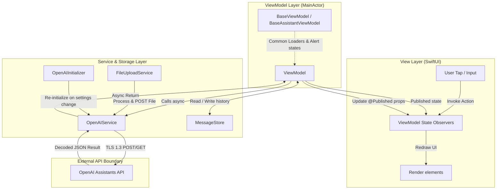
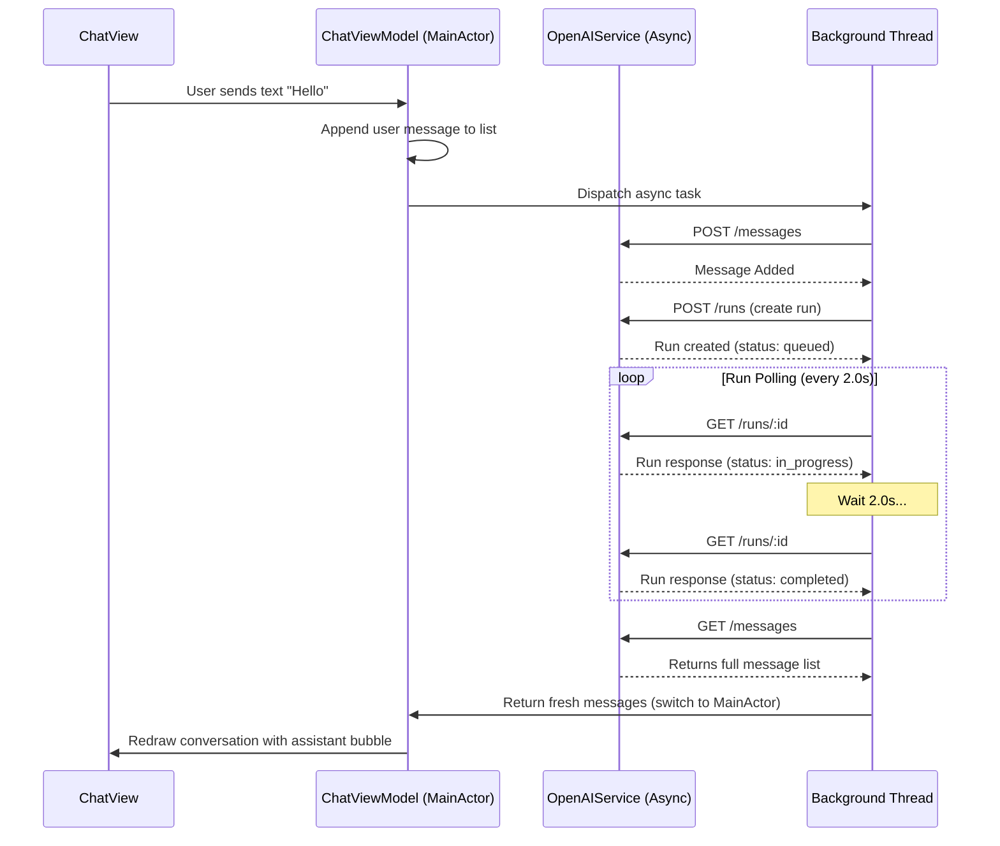

# Architecture Specification
<p align="center">
  <strong>System blueprint detailing design patterns, component relationships, tech stacks, concurrency models, and API specifications.</strong>
</p>

---

## 🏛️ 1. Architectural Thesis

OpenAssistant is structured using the **MVVM-S (Model-View-ViewModel-Service)** architecture, tailored to support reactive SwiftUI layouts. The primary goal is separation of concerns and unidirectional data flow. 

To prevent architectural decay, the codebase enforces the following:
- **Thin Declarative Views**: Views only layout elements and bind to ViewModel states. They perform no network operations or business logic.
- **MainActor ViewModels**: All ViewModel classes inherit from Base classes and are pinned to the `@MainActor` to ensure UI state modifications execute safely on the main thread.
- **Stateless Services**: Networking services handle configuration and raw HTTP requests. They do not retain execution state (e.g., chat histories or loading states).
- **Decoupled Synchronization**: Views and ViewModels avoid direct references where possible, instead notifying each other of data updates via `NotificationCenter` broadcasts.

---

## 🗺️ 2. Architectural Layer Diagram

This diagram visualizes how events flow from the user interactions through the layers, and how network responses modify the state:



---

## 🧱 3. Layer-by-Layer Breakdown

### View Layer (SwiftUI)
The user interface is entirely written in SwiftUI:
- **App Entry**: [OpenAssistantApp.swift](OpenAssistant/Main/OpenAssistantApp.swift) boots the system, configuring Firebase and injecting global ViewModels (`AssistantManagerViewModel`, `VectorStoreManagerViewModel`, `MessageStore`) into the SwiftUI Environment.
- **Tabs**: [MainTabView.swift](OpenAssistant/Main/MainTabView.swift) switches between `ChatView`, `VectorStoreListView`, `AssistantManagerView`, and `SettingsView`.
- **Previews**: Supported by SwiftUI `#Preview` macros using inline mock configurations.

### ViewModel Layer (Reactive Controllers)
ViewModels handle user actions and map services:
- **`BaseViewModel`**: Located in [BaseViewModel.swift](OpenAssistant/MVVMs/Bases/BaseViewModel.swift), handles common asynchronous loading flags (`isLoading`), error states, and wraps execution in a safe helper: `performServiceAction`.
- **`ChatViewModel`**: Located in [ChatViewModel.swift](OpenAssistant/MVVMs/Chat/ChatViewModel.swift), coordinates sending messages, appending to local cache, and polling execution status.
- **`AssistantManagerViewModel`**: Located in [AssistantManagerViewModel.swift](OpenAssistant/MVVMs/Assistants/AssistantManager/AssistantManagerViewModel.swift), handles creating, updating, and fetching OpenAI assistant configs.
- **`VectorStoreManagerViewModel`**: Located in [VectorStoreManagerViewModel.swift](OpenAssistant/MVVMs/VectorStores/VectorStoreManagerViewModel.swift), fetches and deletes vector stores, coordinating local file updates.

### Service Layer (APIs & Storage)
Services perform side effects:
- **`OpenAIService`**: Located in [OpenAIService.swift](OpenAssistant/APIService/OpenAIService.swift), serves as the core URLSession wrapper. It implements exponential backoff retry logic.
- **`FileUploadService`**: Located in [FileUploadService.swift](OpenAssistant/MVVMs/VectorStores/Files/FileUploadService.swift), reads local files, delegates them to `FileProcessor` for HEIC/RTF conversions, and uploads the final binary via multipart forms.
- **`MessageStore`**: Located in [MessageStore.swift](OpenAssistant/MVVMs/Chat/ChatParts/MessageStore.swift), persists the thread history locally to `UserDefaults` as JSON data under `"savedMessages"`.

---

## ⚡ 4. Concurrency Model

OpenAssistant combines modern Swift Concurrency (`async/await`) with the `Combine` framework:
1. **ViewModel MainActor Binding**: Prevents background thread UI crashes by pinning views to the main run loop.
2. **Background Thread Processing**: Local file conversions and multipart data assembly run off the main thread to keep the interface highly responsive.
3. **Timer-Based Active Polling**: Polling logic uses background queue requests dispatched at regular intervals, updating the main thread only when a state change (completed, failed) is detected.



---

## 🗃️ 5. State Management & Data Persistence

### Unidirectional Lifecycle
1. User actions trigger methods on a ViewModel.
2. The ViewModel modifies a local loading flag or calls a Service.
3. The Service queries OpenAI's server and returns codable entities.
4. The ViewModel updates its `@Published` properties.
5. The View redraws in response to publisher updates.

### Local Storage Schema
The application uses local sandboxed memory:
- **`savedMessages`**: Plist-serialized JSON array in `UserDefaults` representing active conversations, mapped by thread ID.
- **`OpenAI_API_Key`**: Plaintext setting in `UserDefaults` updated on settings changes, prompting immediate service re-initialization.

---

## 📡 6. Service Boundary & API Specifications

The application connects directly to OpenAI's server at `api.openai.com/v1` using TLS 1.3.

### Required HTTP Headers
```http
Authorization: Bearer <API_KEY>
Content-Type: application/json
OpenAI-Beta: assistants=v2
```

### Endpoints Integration Map

| Concern | HTTP Method | Path | Purpose |
|---|---|---|---|
| **Assistants** | `GET` | `/v1/assistants` | Retrieve custom assistant profiles |
| **Assistants** | `POST` | `/v1/assistants` | Create an assistant |
| **Assistants** | `DELETE` | `/v1/assistants/{id}` | Remove an assistant configuration |
| **Vector Stores** | `POST` | `/v1/vector_stores` | Create a knowledge store |
| **Vector Stores** | `GET` | `/v1/vector_stores` | List vector stores |
| **Vector Stores** | `POST` | `/v1/vector_stores/{id}/file_batches` | Link files to a store |
| **Files** | `POST` | `/v1/files` | Upload media files |
| **Threads** | `POST` | `/v1/threads` | Open a new session thread |
| **Messages** | `POST` | `/v1/threads/{id}/messages` | Add a message |
| **Runs** | `POST` | `/v1/threads/{id}/runs` | Trigger assistant execution |
| **Runs** | `GET` | `/v1/threads/{id}/runs/{run_id}` | Poll status of execution |

---

## 🧱 7. Error Handling & Observability

- **`OpenAIServiceError`**: Standardized enum wrapping network errors, authentication failures (401), rate limits (429), decoding errors, and server issues (5xx).
- **`IdentifiableError`**: Maps raw error strings to SwiftUI identifiable models, presenting simple alert sheets to users.
- **Console Telemetry**: Extensive print debugging logs network payloads, serialize errors, and polling events.

---

## 🧪 8. Testing Strategy

The repository does not contain active unit tests. Verification relies on manual QA.

### Proposed testing target structure for future phases:
1. **Mock Session Verification**: Inject `URLSessionMock` subclasses to mock server responses and verify that error handlers translate network failures correctly.
2. **Pre-processing Strategies**: Assert that HEIC files result in JPEG data, and RTF documents result in plain text UTF-8 data.

---

## ⚖️ 9. Architectural Tradeoffs

- **UserDefaults vs Keychain**: AppStorage provides native SwiftUI integrations but lacks secure Keychain storage. Keychain encryption is planned as a milestone.
- **Polling vs WebSockets**: The Assistants API relies on REST endpoints requiring polling. This increases battery consumption compared to real-time WebSockets.
- **Direct-to-API Architecture**: Running the client directly off OpenAI ensures privacy and simplicity, but limits the ability to hide credentials or cache vector queries in a central server.

---

## 🛠️ 10. Extension Points

- **Whisper Integration**: Add Whisper speech-to-text API calls inside `AudioTranscriptionStrategy` to replace the text transcription placeholders.
- **SwiftData Storage**: Transition `MessageStore` from UserDefaults-based JSON storage to SwiftData for improved query speeds and relational data capabilities.
