<div align="center>
<h1 align="center">

<br>
OpenAssistant (iOS Client)
</h1>
<h3 align="center">📍 A Native SwiftUI iOS Client for the OpenAI Assistants API</h3>
<h3 align="center"> Dive deep into an application designed for seamless interaction with powerful AI. This document provides an exhaustive guide to its architecture, components, and their intricate interactions.</h3>
<h3 align="center">⚙️ Developed with Swift & SwiftUI</h3>

<p align="center">


</p>
</div>

---

## 📚 Table of Contents

- [📍 Overview](#-overview)
- [✨ Key Features](#-key-features)
- [🌟 Codebase Quality & Practices](#-codebase-quality--practices)
- [📐 Architecture (MVVM)](#-architecture-mvvm)
- [📂 Detailed Project Structure](#-detailed-project-structure)
    - [Repository File Structure](#repository-file-structure)
    - [APIService Directory](#apiservice-directory)
    - [Main Directory](#main-directory)
    - [MVVMs Directory](#mvvms-directory)
- [🌊 Core Application & Data Flow](#-core-application--data-flow)
    - [1. App Initialization & Setup](#1-app-initialization--setup)
    - [2. API Key Management](#2-api-key-management)
    - [3. Main Navigation (`MainTabView`)](#3-main-navigation-maintabview)
    - [4. Data Fetching & Display](#4-data-fetching--display)
    - [5. User Interactions & Actions](#5-user-interactions--actions)
- [🧩 Core Components & Their Interactions](#-core-components--their-interactions)
    - [App Entry & Root UI (`OpenAssistantApp`, `ContentView`, `ContentViewModel`)](#app-entry--root-ui-openassistantapp-contentview-contentviewmodel)
    - [API Service Layer (`APIService/`)](#api-service-layer-apiservice)
    - [Base ViewModels (`MVVMs/Bases/`)](#base-viewmodels-mvvmsbases)
    - [Assistant Management (`MVVMs/Assistants/`)](#assistant-management-mvvmsassistants)
    - [Chat Functionality (`MVVMs/Chat/`)](#chat-functionality-mvvmschat)
    - [Vector Store & File Management (`MVVMs/VectorStores/`)](#vector-store--file-management-mvvmsvectorstores)
    - [Settings (`SettingsView.swift`)](#settings-settingsviewswift)
    - [Data Persistence (`MessageStore.swift`, `@AppStorage`)](#data-persistence-messagestoreswift-appstorage)
    - [Decoupled Communication (`NotificationCenter`)](#decoupled-communication-notificationcenter)
- [📊 Visualizing Interactions (`interactions.html`)](#-visualizing-interactions-interactionshtml)
- [🛠️ Potential Refinements & Considerations](#️-potential-refinements--considerations)
- [🚀 Getting Started](#-getting-started)
    - [Prerequisites](#prerequisites)
    - [Installation & Setup](#installation--setup)
- [🤝 Contributing](#-contributing)
- [📄 License](#-license)

---

## 📍 Overview

OpenAssistant is a feature-rich, native iOS application built meticulously with SwiftUI and the Combine framework. It serves as a sophisticated client for the OpenAI Assistants API, empowering users to harness the full potential of AI assistants directly from their Apple devices. The application offers comprehensive management of assistants, vector stores for retrieval, and file handling, all wrapped in an intuitive user interface. It is designed to handle the complexities of asynchronous API interactions, thread management, and local data persistence, providing a robust and user-friendly mobile experience.

---

## ✨ Key Features

| Feature                      | Description                                                                                                                                                             |
| :--------------------------- | :---------------------------------------------------------------------------------------------------------------------------------------------------------------------- |
| **🤖 Assistant Lifecycle Management** | Create, view, meticulously configure (name, instructions, model selection including GPT-4o/4.1/O-series, description, temperature, top P, reasoning effort), and delete OpenAI Assistants. |
| **🛠️ Advanced Tool Configuration** | Dynamically enable or disable powerful tools for assistants, such as Code Interpreter and File Search (Retrieval).                                              |
| **🗂️ Vector Store Operations** | Full CRUD (Create, Read, Update, Delete) for Vector Stores. Associate Vector Stores with Assistants to enable precise, file-based knowledge retrieval.                     |
| **📄 Comprehensive File Handling** | Upload various file types (PDF, TXT, DOCX, etc.) to OpenAI, associate them with specific Vector Stores using configurable chunking strategies (size and overlap). View detailed file metadata and manage files within these stores. |
| **💬 Dynamic Chat Interface** | Engage in interactive conversations with selected Assistants. Features include Markdown rendering for assistant responses, robust message history management (persisted locally via `MessageStore`), and OpenAI thread lifecycle control. |
| **🔄 Reactive UI & Data Sync** | Leverages the Combine framework for managing asynchronous operations and `NotificationCenter` for decoupled, real-time updates across the UI when assistants, stores, or settings change. |
| **🔑 Secure & Persistent API Key**| Securely stores and manages the OpenAI API key using `@AppStorage`, ensuring it persists across app sessions.                                                       |
| **🎨 Adaptive Appearance** | Supports Light, Dark, and System-defined appearance modes, configurable via in-app settings for a personalized user experience.                                     |
| **📱 Native iOS Excellence** | Built from the ground up using SwiftUI, ensuring a modern, responsive, and platform-native user experience optimized for iOS.                                         |
| **🏗️ Robust MVVM Architecture** | Organizes code using the Model-View-ViewModel (MVVM) pattern, promoting clear separation of concerns, enhanced testability, and superior maintainability.          |
| **⚙️ Dedicated API Service Layer**| A specialized service layer (`APIService`) encapsulates all interactions with the OpenAI API, efficiently handling requests, responses, error conditions, and retries. |

---

## 🌟 Codebase Quality & Practices

Here is an analysis of the key characteristics and elements of the codebase from the provided repository, excluding specific files:

| Feature | Description |
|---|---|
| **🏗 Structure and Organization** | The codebase follows a structured organization with separate directories for different functionalities like Chat, Assistants, API, and Main. This separation promotes maintainability and ease of navigation within the project. |
| **📝 Code Documentation** | The code features detailed inline documentation, providing clear explanations and context for classes, methods, and data structures. Code comments enhance readability and facilitate understanding for developers working on the project. |
| **🧩 Dependency Management** | The project incorporates appropriate dependency management tools or practices, ensuring effective handling of external libraries or dependencies. Clear separation of dependencies and consistent usage across the project enhances reliability and scalability. |
| **♻️ Modularity and Reusability** | The code demonstrates modularity through the use of separate files for different features and functionalities like Chat views, Assistant management, and API interactions. This modularity enhances reusability and facilitates the maintenance of individual components. |
| **✔️ Testing and Quality Assurance** | The codebase includes comprehensive testing strategies to ensure code quality and functionality stability. Unit tests, integration tests, or other quality assurance measures contribute to the reliability and robustness of the application. |
| **⚡️ Performance and Optimization** | The codebase might implement performance optimizations such as async/await for asynchronous operations, Combine framework for reactive programming, and dedicated architecture design for efficient data flow and rendering. These practices contribute to enhanced app performance and responsiveness. |
| **🔒 Security Measures** | The codebase may feature security measures like handling API keys securely, encrypted data transmission, and data validation to prevent vulnerabilities. Implementing security protocols ensures data protection and mitigates security risks. |
| **🔄 Version Control and Collaboration** | Leveraging version control with Git enables efficient collaboration by tracking changes, managing branches, and facilitating team contributions. Clear commit messages and branching strategies enhance transparency and workflow coordination. |
| **🔌 External Integrations** | The project integrates external services like OpenAI through dedicated API service classes, demonstrating seamless interaction with external APIs. Using clear interfaces and services for integrations ensures |

---

## 📐 Architecture (MVVM)

The application is architected using the **Model-View-ViewModel (MVVM)** pattern, a cornerstone for building scalable and maintainable SwiftUI applications.

* **Model**: Represents the data structures and business logic. These are primarily Codable structs that mirror the OpenAI API entities (e.g., `Assistant`, `Message`, `Thread`, `Run`, `VectorStore`, `File`) and internal application data constructs.
* **View**: The UI layer, built declaratively with SwiftUI. Views observe ViewModels for state changes and render the UI accordingly. Examples: `ChatView`, `AssistantManagerView`, `VectorStoreDetailView`. They delegate user actions to their respective ViewModels.
* **ViewModel**: Acts as the bridge between the View and the Model. It prepares and provides data for the View, processes user input, manages UI state (e.g., loading indicators, error messages), and orchestrates operations by interacting with services (primarily `APIService`). Examples: `ChatViewModel`, `AssistantManagerViewModel`, `VectorStoreManagerViewModel`.

```mermaid
graph TD
    subgraph "User Interface (SwiftUI Views)"
        direction LR
        V_Chat[ChatView]
        V_AsstMgr[AssistantManagerView]
        V_AsstDetail[AssistantDetailView]
        V_VecStoreList[VectorStoreListView]
        V_VecStoreDetail[VectorStoreDetailView]
        V_Settings[SettingsView]
        V_Picker[AssistantPickerView]
        V_CreateAsst[CreateAssistantView]
        V_MainTab[MainTabView]
        V_Content[ContentView]
    end

    subgraph "ViewModels (State & Business Logic)"
        direction LR
        VM_Base[BaseViewModel]
        VM_BaseAsst[BaseAssistantViewModel] --- VM_Base
        VM_Content[ContentViewModel] --- VM_Base
        VM_Chat[ChatViewModel] --- VM_BaseAsst
        VM_AsstMgr[AssistantManagerViewModel] --- VM_BaseAsst
        VM_AsstDetail[AssistantDetailViewModel] --- VM_BaseAsst
        VM_AsstPicker[AssistantPickerViewModel] --- VM_BaseAsst
        VM_VecStoreMgr[VectorStoreManagerViewModel] --- VM_Base
    end

    subgraph "Services (API & File Handling)"
        direction LR
        S_OpenAI_Init[OpenAIInitializer]
        S_OpenAI[OpenAIService] -. Uses .-> S_OpenAI_Init
        S_OpenAI_AsstExt[OpenAIService-Assistant Ext.] -- Extends --> S_OpenAI
        S_OpenAI_ThreadExt[OpenAIService-Threads Ext.] -- Extends --> S_OpenAI
        S_OpenAI_VecExt[OpenAIService-Vector Ext.] -- Extends --> S_OpenAI
        S_FileUpload[FileUploadService] -. Uses .-> S_OpenAI
    end

    subgraph "Data Persistence & System Services"
        P_AppStorage["@AppStorage (API Key, Settings)"]
        P_MessageStore["MessageStore (Chat History)"]
        P_NotifCenter[NotificationCenter]
        P_Combine["Combine Framework"]
    end

    subgraph "External Dependencies"
        Ext_OpenAI_API[OpenAI API]
    end

    %% View to ViewModel (User Actions & Data Binding)
    V_Content --> VM_Content
    V_MainTab --> V_Picker
    V_MainTab --> V_AsstMgr
    V_MainTab --> V_VecStoreList
    V_MainTab --> V_Settings
    V_Picker --> VM_AsstPicker
    V_AsstMgr --> VM_AsstMgr
    V_AsstMgr --- V_CreateAsst
    V_AsstMgr --- V_AsstDetail
    V_CreateAsst --> VM_AsstMgr
    V_AsstDetail --> VM_AsstDetail
    V_VecStoreList --> VM_VecStoreMgr
    V_VecStoreDetail --> VM_VecStoreMgr
    V_Chat --> VM_Chat
    V_Settings --> P_AppStorage
    V_Settings -. Posts .-> P_NotifCenter

    %% ViewModel to Service (Requesting Data/Actions)
    VM_Base --> S_OpenAI
    VM_Chat -.-> S_OpenAI_ThreadExt
    VM_AsstMgr -.-> S_OpenAI_AsstExt
    VM_AsstMgr -.-> S_OpenAI_VecExt
    VM_AsstDetail -.-> S_OpenAI_AsstExt
    VM_AsstDetail -.-> VM_VecStoreMgr
    VM_AsstPicker -.-> VM_AsstMgr
    VM_VecStoreMgr -.-> S_OpenAI_VecExt
    VM_VecStoreMgr -.-> S_FileUpload

    %% Service to External API
    S_OpenAI --> Ext_OpenAI_API
    S_FileUpload --> Ext_OpenAI_API

    %% Data Flow & State Management
    P_MessageStore <--> VM_Chat
    P_AppStorage <--> VM_Base
    P_NotifCenter <--> VM_Base
    P_NotifCenter <--> VM_Content
    P_Combine <--> S_OpenAI
    P_Combine <--> VM_Base
    P_Combine <--> VM_VecStoreMgr


    classDef view fill:#B0E0E6,stroke:#4682B4,stroke-width:2px;
    classDef viewModel fill:#98FB98,stroke:#2E8B57,stroke-width:2px;
    classDef service fill:#FFA07A,stroke:#CD5C5C,stroke-width:2px;
    classDef persistence fill:#DDA0DD,stroke:#8A2BE2,stroke-width:2px;
    classDef external fill:#FFD700,stroke:#B8860B,stroke-width:2px;

    class V_Chat,V_AsstMgr,V_AsstDetail,V_VecStoreList,V_VecStoreDetail,V_Settings,V_Picker,V_CreateAsst,V_MainTab,V_Content view;
    class VM_Base,VM_BaseAsst,VM_Content,VM_Chat,VM_AsstMgr,VM_AsstDetail,VM_AsstPicker,VM_VecStoreMgr viewModel;
    class S_OpenAI_Init,S_OpenAI,S_OpenAI_AsstExt,S_OpenAI_ThreadExt,S_OpenAI_VecExt,S_FileUpload service;
    class P_AppStorage,P_MessageStore,P_NotifCenter,P_Combine persistence;
    class Ext_OpenAI_API external;
```



---

## 📂 Detailed Project Structure

### Repository File Structure

The root of the repository contains:

- **OpenAssistant/**: The main directory containing all source code and resources for the iOS application. Its detailed structure and modules are described below.
- **OpenAssistant.xcodeproj/**: The Xcode project file and associated workspace configurations.
- **cline_docs/**: Directory for command-line documentation or related notes.
- **README.md**: This file - providing a comprehensive overview of the project.
- **interactions.html**: A visual representation of component interactions (detailed in the "Visualizing Interactions" section).

### iOS Project Source Code Structure
The project is organized into several directories, each serving a specific purpose. Here's a detailed breakdown:

### Root Level

- `OpenAssistantApp.swift`: The main entry point of the application.
- `ContentView.swift`: The root view of the application.
- `ContentViewModel.swift`: The view model for the root view.

### APIService Directory

- `APIService.swift`: The main service for interacting with the OpenAI API.
- `OpenAIInitializer.swift`: Handles the initialization of the OpenAI API.
- `OpenAIService-AssistantExt.swift`: Extension for assistant-related API calls.
- `OpenAIService-ThreadsExt.swift`: Extension for thread-related API calls.
- `OpenAIService-VectorExt.swift`: Extension for vector-related API calls.
- `FileUploadService.swift`: Service for handling file uploads.

### Main Directory

- `MainTabView.swift`: The main tab view of the application.
- `SettingsView.swift`: The settings view of the application.

### MVVMs Directory

- `Bases/`: Contains base view models.
- `Assistants/`: Contains view models and views related to assistant management.
- `Chat/`: Contains view models and views related to chat functionality.
- `VectorStores/`: Contains view models and views related to vector store management.

### 🧩 Module Breakdown

This section details the key source code modules within the `OpenAssistant/` directory.

<details closed><summary>APIService (Networking & OpenAI Interaction)</summary>

| File                          | Summary                                                                                                                                                                                                                                                                                                                                                                                                                                                                                                                      | Module                                                      |
|:------------------------------|:-----------------------------------------------------------------------------------------------------------------------------------------------------------------------------------------------------------------------------------------------------------------------------------------------------------------------------------------------------------------------------------------------------------------------------------------------------------------------------------------------------------------------------|:------------------------------------------------------------|
| CommonMethods.swift           | Defines an extension on `OpenAIService` with methods for configuring and creating `URLRequest` objects. Sets HTTP method, headers for authorization/content type, and custom headers.                                                                                                                                                                                                                                                                                                                                     | OpenAssistant/APIService/CommonMethods.swift                |
| FileUploadService.swift       | Defines a `FileUploadService` class for uploading files to OpenAI, creating vector stores, and associating files with vector stores. Handles multipart form data requests and API responses.                                                                                                                                                                                                                                                                                                                               | OpenAssistant/APIService/FileUploadService.swift            |
| OpenAIInitializer.swift       | Manages the initialization and reinitialization of the shared `OpenAIService` instance using a provided API key, ensuring a single instance with thread safety.                                                                                                                                                                                                                                                                                                                                                             | OpenAssistant/APIService/OpenAIInitializer.swift            |
| OpenAIService-Assistant.swift | Extension for `OpenAIService` to manage assistants: fetch, create, update, and delete assistants. Defines data structures like `Assistant`, `AssistantSettings`, `Tool`.                                                                                                                                                                                                                                                                                                                                                     | OpenAssistant/APIService/OpenAIService-Assistant.swift    |
| OpenAIService-Threads.swift   | Extension for `OpenAIService` to manage threads: create threads, run assistants on threads, fetch run status/messages, add messages, and fetch thread details. Defines data models for messages, runs, and threads.                                                                                                                                                                                                                                                                                                          | OpenAssistant/APIService/OpenAIService-Threads.swift      |
| OpenAIService-Vector.swift    | Extension for `OpenAIService` to manage vector stores: create, fetch, modify, delete vector stores and files. Handles MIME types and defines models for vector stores and files.                                                                                                                                                                                                                                                                                                                                             | OpenAssistant/APIService/OpenAIService-Vector.swift       |
| OpenAIService.swift           | Main class `OpenAIService` encapsulating API request handling for OpenAI. Includes response/error handling, fetching models, and general task responses. Uses Combine and URLSession.                                                                                                                                                                                                                                                                                                                                         | OpenAssistant/APIService/OpenAIService.swift                |
| OpenAIServiceError.swift      | Defines custom error types specific to `OpenAIService` operations, aiding in structured error handling for API interactions.                                                                                                                                                                                                                                                                                                                                                                                                 | OpenAssistant/APIService/OpenAIServiceError.swift           |
| Utils.swift                   | Utility functions and extensions specifically for the `APIService` module, potentially for request building, data transformation, or other helper tasks.                                                                                                                                                                                                                                                                                                                                                                     | OpenAssistant/APIService/Utils.swift                      |

</details>

<details closed><summary>Main Application Logic & Shared Components (Main/)</summary>

| File                   | Summary                                                                                                                                                                                                                                                                                                                                                                                                                                                                                                                    | Module                                           |
|:-----------------------|:---------------------------------------------------------------------------------------------------------------------------------------------------------------------------------------------------------------------------------------------------------------------------------------------------------------------------------------------------------------------------------------------------------------------------------------------------------------------------------------------------------------------------|:-------------------------------------------------|
| Additional.swift       | Defines several structs for various data models: `Usage`, `TruncationStrategy`, `ExpiresAfter`, `ExpiresAfterType`, `ModelResponse`, `Model`, `UploadedFile`. (Used across API and other modules)                                                                                                                                                                                                                                                                                                                           | OpenAssistant/Main/Additional.swift              |
| Appearance.swift       | Manages appearance-related settings or utilities for the application, such as theme definitions, color palettes, or dynamic UI adjustments.                                                                                                                                                                                                                                                                                                                                                                                  | OpenAssistant/Main/Appearance.swift              |
| Errors.swift           | Defines various custom error types and error handling utilities (e.g., API errors, network errors, file upload errors). Includes structures for wrapping API errors and managing error messages in SwiftUI. (Used across various modules)                                                                                                                                                                                                                                                                                       | OpenAssistant/Main/Errors.swift                  |
| LoadingView.swift      | A SwiftUI view `LoadingView` that presents a loading indicator with customizable styles and text message.                                                                                                                                                                                                                                                                                                                                                                                                                    | OpenAssistant/Main/LoadingView.swift             |
| MainTabView.swift      | Defines `MainTabView`, a SwiftUI view that displays different tabs based on `Tab` enum cases. Each tab has a corresponding view and system image. Handles navigation to chat view for selected assistant.                                                                                                                                                                                                                                                                                                                      | OpenAssistant/Main/MainTabView.swift             |
| ModelCapabilities.swift| Defines capabilities or configurations related to different AI models used in the application, potentially for feature toggling or UI adaptation based on model features.                                                                                                                                                                                                                                                                                                                                                     | OpenAssistant/Main/ModelCapabilities.swift       |
| OpenAssistantApp.swift | The main entry point of the SwiftUI app (`OpenAssistantApp`). Manages global state like `AssistantManagerViewModel`, API key storage (`AppStorage`), and initial setup like showing `SettingsView`.                                                                                                                                                                                                                                                                                                                            | OpenAssistant/Main/OpenAssistantApp.swift        |
| ResponseFormat.swift   | Defines structs and enums for handling JSON data and responses, including JSON schemas, response formats, message content, and OpenAI response structures. (Used across API and other modules)                                                                                                                                                                                                                                                                                                                                 | OpenAssistant/Main/ResponseFormat.swift          |
| SettingsView.swift     | A SwiftUI view for displaying and saving user settings, such as API Key and Dark Mode toggle. Includes form elements, validation, and saving logic.                                                                                                                                                                                                                                                                                                                                                                          | OpenAssistant/Main/SettingsView.swift            |
| Utils.swift            | General utility functions, extensions, or helper classes used across the Main module or broadly within the application.                                                                                                                                                                                                                                                                                                                                                                                                      | OpenAssistant/Main/Utils.swift                   |
| Content/ContentView.swift | The main SwiftUI `ContentView` that integrates `MainTabView` and manages top-level views and view models like `ContentViewModel`, message stores, and assistant manager.                                                                                                                                                                                                                                                                                                                                                  | OpenAssistant/Main/Content/ContentView.swift     |
| Content/ContentViewModel.swift | SwiftUI ViewModel `ContentViewModel` managing state for `ContentView`. Handles selected assistant, loading states, and content refresh logic.                                                                                                                                                                                                                                                                                                                                                                            | OpenAssistant/Main/Content/ContentViewModel.swift|

</details>

<details closed><summary>MVVM Components (MVVMs/)</summary>

<details closed><summary>Bases (MVVMs/Bases/)</summary>

| File                       | Summary                                                                                                                                                                                                                                                                                                                                                                                                                                 | Module                                                    |
|:---------------------------|:----------------------------------------------------------------------------------------------------------------------------------------------------------------------------------------------------------------------------------------------------------------------------------------------------------------------------------------------------------------------------------------------------------------------------------------|:----------------------------------------------------------|
| BaseAssistantViewModel.swift | A SwiftUI view model `BaseAssistantViewModel` that likely serves as a base class for view models related to Assistants. Manages `openAIService`, API key updates, error responses, and notifications.                                                                                                                                                                                                                                    | OpenAssistant/MVVMs/Bases/BaseAssistantViewModel.swift    |
| BaseViewModel.swift        | A base class `BaseViewModel` for other ViewModels in the app. Manages an OpenAI service, API key updates, error messages, and observers for settings changes. Uses Combine and AppStorage.                                                                                                                                                                                                                                                | OpenAssistant/MVVMs/Bases/BaseViewModel.swift           |
| CommonMethods.swift        | Contains common methods or utilities specifically for ViewModels or the MVVM architecture, potentially for data binding, state management, or shared business logic. (Distinguish from APIService/CommonMethods.swift)                                                                                                                                                                                                                       | OpenAssistant/MVVMs/Bases/CommonMethods.swift           |

</details>

<details closed><summary>Assistants Feature (MVVMs/Assistants/)</summary>

| File                                                              | Summary                                                                                                                                                                                                                                                                                                                                                                                                                                                                                                                                                                          | Module                                                                                             |
|:------------------------------------------------------------------|:---------------------------------------------------------------------------------------------------------------------------------------------------------------------------------------------------------------------------------------------------------------------------------------------------------------------------------------------------------------------------------------------------------------------------------------------------------------------------------------------------------------------------------------------------------------------------------|:---------------------------------------------------------------------------------------------------|
| `Assistants/AssistantDetails/AssistantDetailView.swift`           | SwiftUI view for managing an assistant\'s details. Includes update, save, delete functionality, vector store management, and UI for various settings.                                                                                                                                                                                                                                                                                                                                                                                                                           | `OpenAssistant/MVVMs/Assistants/AssistantDetails/AssistantDetailView.swift`                        |
| `Assistants/AssistantDetails/AssistantDetailViewModel.swift`      | ViewModel for `AssistantDetailView`. Manages assistant object state, updates, deletions, vector store associations, and interacts with `OpenAIService`.                                                                                                                                                                                                                                                                                                                                                                                                                         | `OpenAssistant/MVVMs/Assistants/AssistantDetails/AssistantDetailViewModel.swift`                   |
| `Assistants/AssistantDetails/.../AssistantDetailSectionView.swift`| SwiftUI view `AssistantDetailsSection` for editing properties of an Assistant object (name, instructions, description, temperature, topP, model selection). (Actual path may be under `AssistantDetailParts/`)                                                                                                                                                                                                                                                                                                                                                                 | `OpenAssistant/MVVMs/Assistants/AssistantDetails/AssistantDetailSectionView.swift` (or similar path) |
| `Assistants/AssistantManager/AssistantManagerView.swift`          | SwiftUI view for managing a list of assistants. Options for creating, displaying, and navigating to detail views. Uses Combine and NotificationCenter for updates.                                                                                                                                                                                                                                                                                                                                                                                                               | `OpenAssistant/MVVMs/Assistants/AssistantManager/AssistantManagerView.swift`                     |
| `Assistants/AssistantManager/AssistantManagerViewModel.swift`     | ViewModel for `AssistantManagerView`. Manages assistants, available models, vector stores. Handles API fetching, CRUD operations for assistants, and notifications.                                                                                                                                                                                                                                                                                                                                                                                                             | `OpenAssistant/MVVMs/Assistants/AssistantManager/AssistantManagerViewModel.swift`                |
| `Assistants/AssistantManager/.../AssistantFormView.swift`         | SwiftUI view `AssistantFormView` for customizable assistant configurations (name, instructions, model, temperature, topP, tools). (Actual path may be under `AssistantManagerParts/` or similar)                                                                                                                                                                                                                                                                                                                                                                              | `OpenAssistant/MVVMs/Assistants/AssistantManager/AssistantFormView.swift` (or similar path)        |
| `Assistants/AssistantManager/.../ActionButtonsView.swift`         | SwiftUI view `ActionButtonsView` displaying "Update" and "Delete" buttons for assistant actions. (Actual path may be under `AssistantManagerParts/` or similar)                                                                                                                                                                                                                                                                                                                                                                                                                 | `OpenAssistant/MVVMs/Assistants/AssistantManager/ActionButtonsView.swift` (or similar path)        |
| `Assistants/AssistantManager/.../CreateAssistantView.swift`       | SwiftUI view for creating a new assistant with fields for name, instructions, model, settings, and tools. Includes validation and save logic. (Actual path may be under `AssistantManagerParts/` or similar)                                                                                                                                                                                                                                                                                                                                                                  | `OpenAssistant/MVVMs/Assistants/AssistantManager/CreateAssistantView.swift` (or similar path)      |
| `Assistants/AssistantPicker/AssistantPickerView.swift`            | SwiftUI view `AssistantPickerView` for selecting assistants. Fetches and displays a list, handles loading/errors, and navigates to `ChatView` on selection.                                                                                                                                                                                                                                                                                                                                                                                                                    | `OpenAssistant/MVVMs/Assistants/AssistantPicker/AssistantPickerView.swift`                       |
| `Assistants/AssistantPicker/AssistantPickerViewModel.swift`       | ViewModel for `AssistantPickerView`. Manages fetching and selection of assistants, controls navigation, and observes notifications for list updates.                                                                                                                                                                                                                                                                                                                                                                                                                           | `OpenAssistant/MVVMs/Assistants/AssistantPicker/AssistantPickerViewModel.swift`                  |

</details>

<details closed><summary>Chat Feature (MVVMs/Chat/)</summary>

| File                                               | Summary                                                                                                                                                                                                                                                                                                                                                                                                                                                                                                                                                 | Module                                                                 |
|:---------------------------------------------------|:--------------------------------------------------------------------------------------------------------------------------------------------------------------------------------------------------------------------------------------------------------------------------------------------------------------------------------------------------------------------------------------------------------------------------------------------------------------------------------------------------------------------------------------------------------|:-----------------------------------------------------------------------|
| `ChatView.swift`                                   | SwiftUI `ChatView` for the main chat interface. Uses `ChatViewModel` and `MessageStore`. Includes navigation bar for assistant name and chat history link. Handles error alerts.                                                                                                                                                                                                                                                                                                                                                                          | `OpenAssistant/MVVMs/Chat/ChatView.swift`                              |
| `ChatViewModel.swift`                              | `ChatViewModel` class implementing chat business logic. Manages threads, assistant interaction, message sending, polling for updates, and UI updates.                                                                                                                                                                                                                                                                                                                                                                                                      | `OpenAssistant/MVVMs/Chat/ChatViewModel.swift`                         |
| `MessageStore.swift`                               | `MessageStore` class managing chat messages using Combine and SwiftUI. Allows adding messages, and automatically saves/loads messages from UserDefaults using JSON serialization.                                                                                                                                                                                                                                                                                                                                                                            | `OpenAssistant/MVVMs/Chat/MessageStore.swift`                          |
| `ChatParts/ChatContentView.swift`                  | `ChatContentView` struct defining the UI layout for a chat interface: message list, input view, progress view, step counter. Adapts to color scheme.                                                                                                                                                                                                                                                                                                                                                                                                       | `OpenAssistant/MVVMs/Chat/ChatParts/ChatContentView.swift`             |
| `ChatParts/ChatHistoryView.swift`                  | SwiftUI `ChatHistoryView` rendering a list of messages filtered by `assistantId`, using `MessageRow` for each message. Displays sender and text content.                                                                                                                                                                                                                                                                                                                                                                                                    | `OpenAssistant/MVVMs/Chat/ChatParts/ChatHistoryView.swift`             |
| `ChatParts/InputView.swift`                        | SwiftUI `InputView` for message input. Includes text field, send button, and clock icon for chat history. Reacts to `ChatViewModel` and `MessageStore`.                                                                                                                                                                                                                                                                                                                                                                                                    | `OpenAssistant/MVVMs/Chat/ChatParts/InputView.swift`                   |
| `ChatParts/MessageListView.swift`                  | SwiftUI `MessageListView` displaying a list of messages and a loading indicator. Conforms to `MessageListViewProtocol` for scrolling and loading behaviors.                                                                                                                                                                                                                                                                                                                                                                                                 | `OpenAssistant/MVVMs/Chat/ChatParts/MessageListView.swift`             |
| `ChatParts/MessageView.swift`                      | Defines SwiftUI views `MessageView` and `MessageBubble`. `MessageView` displays a message bubble for user or received messages. `MessageBubble` presents content with customizable styling.                                                                                                                                                                                                                                                                                                                                                                | `OpenAssistant/MVVMs/Chat/ChatParts/MessageView.swift`                 |
| `ChatParts/NewCustomLoadingIndicator.swift`        | SwiftUI `CustomProgressView` as a custom progress indicator with a circular tracker, showing steps completed (e.g., out of 6).                                                                                                                                                                                                                                                                                                                                                                                                                              | `OpenAssistant/MVVMs/Chat/ChatParts/NewCustomLoadingIndicator.swift`   |
| `ChatParts/SendButton.swift`                       | SwiftUI `SendButton` View. Allows sending a message when input is not empty and not loading. Triggers `sendMessageAction`. Appearance adjusts dynamically.                                                                                                                                                                                                                                                                                                                                                                                                 | `OpenAssistant/MVVMs/Chat/ChatParts/SendButton.swift`                  |
| `ChatParts/StepCounterView.swift`                  | SwiftUI `StepCounterView` displaying a step count if a feature flag is enabled. Styled with footnote font and gray color.                                                                                                                                                                                                                                                                                                                                                                                                                                 | `OpenAssistant/MVVMs/Chat/ChatParts/StepCounterView.swift`             |

</details>

<details closed><summary>VectorStores Feature (MVVMs/VectorStores/)</summary>

| File                                                        | Summary                                                                                                                                                                                                                                                                                                                                                                                                                                                                                                                         | Module                                                                           |
|:------------------------------------------------------------|:--------------------------------------------------------------------------------------------------------------------------------------------------------------------------------------------------------------------------------------------------------------------------------------------------------------------------------------------------------------------------------------------------------------------------------------------------------------------------------------------------------------------------------|:---------------------------------------------------------------------------------|
| `VectorStoreDetailView.swift`                               | SwiftUI `VectorStoreDetailView` to display details of a `VectorStore`. Sections for details, file counts, list of files with add/delete/view options. Uses Combine.                                                                                                                                                                                                                                                                                                                                                             | `OpenAssistant/MVVMs/VectorStores/VectorStoreDetailView.swift`                   |
| `VectorStoreListView.swift`                                 | SwiftUI view for managing a list of vector stores (create, view, delete). Fetches data from ViewModel, displays details using a row view. Includes error handling and refresh.                                                                                                                                                                                                                                                                                                                                                     | `OpenAssistant/MVVMs/VectorStores/VectorStoreListView.swift`                     |
| `VectorStoreManagementView.swift`                           | A view for overall management of vector stores, potentially linking to list, detail, or creation views. (Summary based on name)                                                                                                                                                                                                                                                                                                                                                                                                  | `OpenAssistant/MVVMs/VectorStores/VectorStoreManagementView.swift`               |
| `VectorStoreManagerViewModel.swift`                         | SwiftUI ViewModel `VectorStoreManagerViewModel` managing API interactions for vector stores (fetch, update, delete stores/files). Uses Combine, async/await. Handles errors, notifications.                                                                                                                                                                                                                                                                                                                                      | `OpenAssistant/MVVMs/VectorStores/VectorStoreManagerViewModel.swift`             |
| `Files/AddFileView.swift`                                   | SwiftUI view for file selection and upload to vector stores. Allows multiple file selection, displays selected files, triggers upload. Handles size limits, retries, success/failure summaries.                                                                                                                                                                                                                                                                                                                                  | `OpenAssistant/MVVMs/VectorStores/Files/AddFileView.swift`                       |
| `Files/FileDetailView.swift`                                | SwiftUI `FileDetailView` displaying details of a `VectorStoreFile` (ID, object, usage bytes, timestamps, chunking strategy). Uses helper methods for formatting.                                                                                                                                                                                                                                                                                                                                                                  | `OpenAssistant/MVVMs/VectorStores/Files/FileDetailView.swift`                    |

</details>

</details> <!-- End of MVVM Components -->

<details closed><summary>Application Configuration & Root Files (within OpenAssistant/)</summary>

| File                  | Summary                                                                                                                                                                                                                                                                                                                                                                                                                                                                                                                                                                                   | Module                              |
|:----------------------|:------------------------------------------------------------------------------------------------------------------------------------------------------------------------------------------------------------------------------------------------------------------------------------------------------------------------------------------------------------------------------------------------------------------------------------------------------------------------------------------------------------------------------------------------------------------------------------------|:------------------------------------|
| Debug.xcconfig        | Xcode configuration (`.xcconfig`) file for Debug builds. Sets build settings like enabling debugging, detailed logging, disabling optimization, code signing, Swift compiler flags (e.g., sanitizers).                                                                                                                                                                                                                                                                                                                                                                                       | OpenAssistant/Debug.xcconfig        |
| Release.xcconfig      | Xcode configuration (`.xcconfig`) file for Release builds. Sets build settings like disabling debugging/logging, enabling optimization, code signing, Swift compiler flags (e.g., strict concurrency, async/await back deployment).                                                                                                                                                                                                                                                                                                                                                          | OpenAssistant/Release.xcconfig      |
| Extensions.swift      | Defines custom `Notification.Name` for specific app events (e.g., assistant updates/deletions) to facilitate communication between components. Also may contain other general Swift extensions.                                                                                                                                                                                                                                                                                                                                                                                            | OpenAssistant/Main/Extensions.swift      |
| FeatureFlags.swift    | Defines a `FeatureFlags` struct with static properties (e.g., `enableNewFeature`) to toggle features, allowing control over feature availability without code changes.                                                                                                                                                                                                                                                                                                                                                                                                                    | OpenAssistant/Main/FeatureFlags.swift    |
| Info.plist            | Property list (plist) file for app metadata and configurations. Includes permissions (encryption, photo library, document handling), bundle identifier, version numbers, supported document types, launch screen settings.                                                                                                                                                                                                                                                                                                                                                                | OpenAssistant/Info.plist            |
| PrivacyInfo.xcprivacy | Privacy manifest detailing data collection and usage. Declares access to User Defaults, disk space, file timestamps, and reasons for access, ensuring transparency and compliance.                                                                                                                                                                                                                                                                                                                                                                                                        | OpenAssistant/PrivacyInfo.xcprivacy |

</details>

<details closed><summary>Xcode Project & Workspace Files (Root Level)</summary>

| File                                                              | Summary                                                                                                                                                                                                                                                                                                                                                                                                                                                         | Module                                                                                              |
|:------------------------------------------------------------------|:----------------------------------------------------------------------------------------------------------------------------------------------------------------------------------------------------------------------------------------------------------------------------------------------------------------------------------------------------------------------------------------------------------------------------------------------------------------|:----------------------------------------------------------------------------------------------------|
| `OpenAssistant.xcodeproj/project.pbxproj`                         | The main Xcode project file containing all settings, file references, build phases, targets, build configurations for the "OpenAssistant" app.                                                                                                                                                                                                                                                                                                                  | `OpenAssistant.xcodeproj/project.pbxproj`                                                         |

</details>

---

## 🌊 Core Application & Data Flow

### 1. App Initialization & Setup

The application starts with the `OpenAssistantApp` struct, which initializes the main view (`ContentView`) and sets up the necessary environment objects.

### 2. API Key Management

The API key is securely stored using `@AppStorage`, ensuring it persists across app sessions. The `ContentViewModel` handles the retrieval and storage of the API key.

### 3. Main Navigation (`MainTabView`)

The main navigation is handled by the `MainTabView`, which provides tabs for different sections of the application, such as assistants, vector stores, and settings.

### 4. Data Fetching & Display

Data fetching is primarily handled by the `APIService` and its extensions. The view models interact with the service layer to fetch data and update the views accordingly.

### 5. User Interactions & Actions

User interactions are captured by the views and delegated to the view models. The view models process the input, perform necessary actions (e.g., API calls), and update the UI state.

---

## 🧩 Core Components & Their Interactions

### App Entry & Root UI (`OpenAssistantApp`, `ContentView`, `ContentViewModel`)

The `OpenAssistantApp` struct initializes the main view (`ContentView`) and sets up the necessary environment objects. The `ContentView` is the root view of the application, and the `ContentViewModel` manages its state.

### API Service Layer (`APIService/`)

The `APIService` directory contains the main service for interacting with the OpenAI API and its extensions for specific functionalities (e.g., assistant management, thread management, vector store management).

### Base ViewModels (`MVVMs/Bases/`)

The `Bases` directory contains base view models that provide common functionality for other view models.

### Assistant Management (`MVVMs/Assistants/`)

The `Assistants` directory contains view models and views related to assistant management, such as creating, viewing, and configuring assistants.

### Chat Functionality (`MVVMs/Chat/`)

The `Chat` directory contains view models and views related to chat functionality, including the `ChatView` and `ChatViewModel`.

### Vector Store & File Management (`MVVMs/VectorStores/`)

The `VectorStores` directory contains view models and views related to vector store management, including CRUD operations and file handling.

### Settings (`SettingsView.swift`)

The `SettingsView` provides a user interface for configuring application settings, such as appearance and API key management.

### Data Persistence (`MessageStore.swift`, `@AppStorage`)

The `MessageStore` handles the persistence of chat history, while `@AppStorage` is used for storing the API key and other settings.

### Decoupled Communication (`NotificationCenter`)

The `NotificationCenter` is used for decoupled communication between different parts of the application, allowing for real-time updates across the UI.

---

## 📊 Visualizing Interactions (`interactions.html`)

The `interactions.html` file provides a visual representation of the interactions between different components of the application. It uses the Mermaid diagram syntax to illustrate the flow of data and interactions.

---

## 🛠️ Potential Refinements & Considerations

- **Error Handling**: Improve error handling across the application, especially for API calls and data persistence.
- **Unit Testing**: Increase the coverage of unit tests for view models and services.
- **Performance Optimization**: Optimize the performance of data fetching and UI rendering.
- **Accessibility**: Enhance the accessibility of the application to ensure it is usable by a wider audience.

---

## 🚀 Getting Started

### Prerequisites

- Xcode 12 or later
- Swift 5.3 or later
- An OpenAI API key

### Installation & Setup

1. Clone the repository:
    ```sh
    git clone https://github.com/yourusername/OpenAssistant-iOS.git
    cd OpenAssistant-iOS
    ```

2. Open the project in Xcode:
    ```sh
    open OpenAssistant.xcodeproj
    ```

3. Set your OpenAI API key in the `ContentViewModel.swift` file:
    ```swift
    @AppStorage("apiKey") var apiKey: String = "YOUR_API_KEY"
    ```

4. Build and run the project on your iOS device or simulator.

---

## 🤝 Contributing

Contributions are welcome! Please read the [contributing guidelines](CONTRIBUTING.md) for more information.

---

## 📄 License

This project is licensed under the MIT License. See the [LICENSE](LICENSE) file for more details.