<div align="center>
<h1 align="center">

<br>
OpenAssistant (iOS Client)
</h1>
<h3 align="center">📍 A Native SwiftUI iOS Client for the OpenAI Assistants API</h3>
<h3 align="center"> Dive deep into an application designed for seamless interaction with powerful AI. This document provides an exhaustive guide to its architecture, components, and their intricate interactions.</h3>
<h3 align="center">⚙️ Developed with Swift & SwiftUI</h3>

<p align="center">


</p>
</div>

-----

## 📚 Table of Contents

- [📍 Overview](https://www.google.com/search?q=%23-overview)
- [✨ Key Features](https://www.google.com/search?q=%23-key-features)
- [🌟 Codebase Quality & Practices](https://www.google.com/search?q=%23-codebase-quality--practices)
- [📐 Architecture (MVVM)](https://www.google.com/search?q=%23-architecture-mvvm)
- [📂 Detailed Project Structure](https://www.google.com/search?q=%23-detailed-project-structure)
  - [Repository File Structure](https://www.google.com/search?q=%23repository-file-structure)
  - [iOS Project Source Code Structure](https://www.google.com/search?q=%23ios-project-source-code-structure)
- [🌊 Core Application & Data Flow](https://www.google.com/search?q=%23-core-application--data-flow)
- [🧩 Core Components & Their Interactions](https://www.google.com/search?q=%23-core-components--their-interactions)
- [📊 Visualizing Interactions (`interactions.html`)](https://www.google.com/search?q=%23-visualizing-interactions-interactionshtml)
- [🛠️ Potential Refinements & Considerations](https://www.google.com/search?q=%23%EF%B8%8F-potential-refinements--considerations)
- [🚀 Getting Started](https://www.google.com/search?q=%23-getting-started)
  - [Prerequisites](https://www.google.com/search?q=%23prerequisites)
  - [Installation & Setup](https://www.google.com/search?q=%23installation--setup)
- [🤝 Contributing](https://www.google.com/search?q=%23-contributing)
- [📄 License](https://www.google.com/search?q=%23-license)

-----

## 📍 Overview

OpenAssistant is a feature-rich, native iOS application built meticulously with SwiftUI and the Combine framework. It serves as a sophisticated client for the OpenAI Assistants API, empowering users to harness the full potential of AI assistants directly from their Apple devices. The application offers comprehensive management of assistants, vector stores for retrieval, and file handling, all wrapped in an intuitive user interface. It is designed to handle the complexities of asynchronous API interactions, thread management, and local data persistence, providing a robust and user-friendly mobile experience.

-----

## ✨ Key Features

| Feature                      | Description                                                                                                                                                             |
| :--------------------------- | :---------------------------------------------------------------------------------------------------------------------------------------------------------------------- |
| **🤖 Assistant Lifecycle Management** | Create, view, meticulously configure (name, instructions, model selection including GPT-4o, description, temperature, top P), and delete OpenAI Assistants.      |
| **🛠️ Advanced Tool Configuration** | Dynamically enable or disable powerful tools for assistants, such as Code Interpreter and File Search (Retrieval).                                                  |
| **🗂️ Vector Store Operations** | Full CRUD (Create, Read, Update, Delete) for Vector Stores. Associate Vector Stores with Assistants to enable precise, file-based knowledge retrieval.                  |
| **📄 Comprehensive File Handling** | Upload various file types (PDF, TXT, DOCX, etc.) to OpenAI, associate them with specific Vector Stores. View detailed file metadata and manage files within these stores. |
| **💬 Dynamic Chat Interface** | Engage in interactive conversations with selected Assistants. Features include Markdown rendering for assistant responses, robust message history management (persisted locally via `MessageStore`), and OpenAI thread lifecycle control. |
| **🔄 Reactive UI & Data Sync** | Leverages the Combine framework for managing asynchronous operations and `NotificationCenter` for decoupled, real-time updates across the UI when assistants, stores, or settings change. |
| **🔑 Persistent API Key** | Stores and manages the OpenAI API key using `@AppStorage`, ensuring it persists across app sessions.                                                                   |
| **🎨 Adaptive Appearance** | Supports Light, Dark, and System-defined appearance modes, configurable via in-app settings for a personalized user experience.                                        |
| **📱 Native iOS Excellence** | Built from the ground up using SwiftUI, ensuring a modern, responsive, and platform-native user experience optimized for iOS.                                        |
| **🏗️ Robust MVVM Architecture** | Organizes code using the Model-View-ViewModel (MVVM) pattern, promoting clear separation of concerns, enhanced testability, and superior maintainability.            |
| **⚙️ Dedicated API Service Layer**| A specialized service layer (`APIService`) encapsulates all interactions with the OpenAI API, efficiently handling requests, responses, and error conditions.      |

-----

## 🌟 Codebase Quality & Practices

This table provides an analysis of the codebase\'s key characteristics.

| Aspect                          | Description                                                                                                                                                                     |
| :------------------------------ | :------------------------------------------------------------------------------------------------------------------------------------------------------------------------------ |
| **🏗️ Structure and Organization** | The codebase is well-organized into a clear directory structure that separates concerns effectively (API Services, UI Views, ViewModels, etc.), enhancing maintainability.      |
| **📝 Code Documentation** | The code features good inline documentation, with comments providing context for classes, methods, and complex logic, which is beneficial for developer onboarding.             |
| **🧩 Modularity and Reusability** | The use of the MVVM pattern and component-based SwiftUI views (e.g., `AssistantFormView`, `MessageView`) promotes modularity and allows for reusable code across the application. |
| **🔒 Security Considerations** | The app uses `@AppStorage` (UserDefaults) for API key persistence. While convenient for development, a more secure method like the **Keychain** is recommended for production.     |
| **✔️ Testing and Quality Assurance** | The project currently **lacks a dedicated testing suite**. There are no XCTest targets for unit or UI tests, which is a key area for future improvement to ensure reliability.   |
| **🔄 Version Control** | The project is managed with Git. Following conventional branching strategies and writing clear commit messages will be crucial for effective team collaboration.             |

-----

## 📐 Architecture (MVVM)

The application is architected using the **Model-View-ViewModel (MVVM)** pattern, a cornerstone for building scalable and maintainable SwiftUI applications.

- **Model**: Represents the data structures and business logic. These are primarily `Codable` structs that mirror the OpenAI API entities (e.g., `Assistant`, `Message`, `Thread`, `Run`, `VectorStore`, `File`) and internal application data constructs.
- **View**: The UI layer, built declaratively with SwiftUI. Views observe ViewModels for state changes and render the UI accordingly. Examples: `ChatView`, `AssistantManagerView`, `VectorStoreDetailView`. They delegate user actions to their respective ViewModels.
- **ViewModel**: Acts as the bridge between the View and the Model. It prepares and provides data for the View, processes user input, manages UI state (e.g., loading indicators, error messages), and orchestrates operations by interacting with services (primarily `APIService`). Examples: `ChatViewModel`, `AssistantManagerViewModel`, `VectorStoreManagerViewModel`.

```mermaid
graph TD
    subgraph "User Interface (SwiftUI Views)"
        direction LR
        V_Chat[ChatView]
        V_AsstMgr[AssistantManagerView]
        V_AsstDetail[AssistantDetailView]
        V_VecStoreList[VectorStoreListView]
        V_VecStoreDetail[VectorStoreDetailView]
        V_Settings[SettingsView]
        V_Picker[AssistantPickerView]
        V_CreateAsst[CreateAssistantView]
        V_MainTab[MainTabView]
        V_Content[ContentView]
    end

    subgraph "ViewModels (State & Business Logic)"
        direction LR
        VM_Base[BaseViewModel]
        VM_BaseAsst[BaseAssistantViewModel] --- VM_Base
        VM_Content[ContentViewModel] --- VM_Base
        VM_Chat[ChatViewModel] --- VM_BaseAsst
        VM_AsstMgr[AssistantManagerViewModel] --- VM_BaseAsst
        VM_AsstDetail[AssistantDetailViewModel] --- VM_BaseAsst
        VM_AsstPicker[AssistantPickerViewModel] --- VM_BaseAsst
        VM_VecStoreMgr[VectorStoreManagerViewModel] --- VM_Base
    end

    subgraph "Services (API & File Handling)"
        direction LR
        S_OpenAI_Init[OpenAIInitializer]
        S_OpenAI[OpenAIService] -. Uses .-> S_OpenAI_Init
        S_OpenAI_AsstExt[OpenAIService-Assistant Ext.] -- Extends --> S_OpenAI
        S_OpenAI_ThreadExt[OpenAIService-Threads Ext.] -- Extends --> S_OpenAI
        S_OpenAI_VecExt[OpenAIService-Vector Ext.] -- Extends --> S_OpenAI
        S_FileUpload[FileUploadService]
    end

    subgraph "Data Persistence & System Services"
        P_AppStorage["@AppStorage (API Key, Settings)"]
        P_MessageStore["MessageStore (Chat History)"]
        P_NotifCenter[NotificationCenter]
        P_Combine["Combine Framework"]
    end

    subgraph "External Dependencies"
        Ext_OpenAI_API[OpenAI API]
    end

    %% View to ViewModel (User Actions & Data Binding)
    V_Content --> VM_Content
    V_MainTab --> V_Picker
    V_MainTab --> V_AsstMgr
    V_MainTab --> V_VecStoreList
    V_MainTab --> V_Settings
    V_Picker --> VM_AsstPicker
    V_AsstMgr --> VM_AsstMgr
    V_AsstMgr --- V_CreateAsst
    V_AsstMgr --- V_AsstDetail
    V_CreateAsst --> VM_AsstMgr
    V_AsstDetail --> VM_AsstDetail
    V_VecStoreList --> VM_VecStoreMgr
    V_VecStoreDetail --> VM_VecStoreMgr
    V_Chat --> VM_Chat
    V_Settings --> P_AppStorage
    V_Settings -. Posts .-> P_NotifCenter

    %% ViewModel to Service (Requesting Data/Actions)
    VM_Base --> S_OpenAI
    VM_Chat -.-> S_OpenAI_ThreadExt
    VM_AsstMgr -.-> S_OpenAI_AsstExt
    VM_AsstMgr -.-> S_OpenAI_VecExt
    VM_AsstDetail -.-> S_OpenAI_AsstExt
    VM_AsstDetail -.-> VM_VecStoreMgr
    VM_AsstPicker -.-> VM_AsstMgr
    VM_VecStoreMgr -.-> S_OpenAI_VecExt
    VM_VecStoreMgr -.-> S_FileUpload

    %% Service to External API
    S_OpenAI --> Ext_OpenAI_API
    S_FileUpload --> Ext_OpenAI_API

    %% Data Flow & State Management
    P_MessageStore <--> VM_Chat
    P_AppStorage <--> VM_Base
    P_NotifCenter <--> VM_Base
    P_NotifCenter <--> VM_Content
    P_Combine <--> S_OpenAI
    P_Combine <--> VM_Base
    P_Combine <--> VM_VecStoreMgr


    classDef view fill:#B0E0E6,stroke:#4682B4,stroke-width:2px;
    classDef viewModel fill:#98FB98,stroke:#2E8B57,stroke-width:2px;
    classDef service fill:#FFA07A,stroke:#CD5C5C,stroke-width:2px;
    classDef persistence fill:#DDA0DD,stroke:#8A2BE2,stroke-width:2px;
    classDef external fill:#FFD700,stroke:#B8860B,stroke-width:2px;

    class V_Chat,V_AsstMgr,V_AsstDetail,V_VecStoreList,V_VecStoreDetail,V_Settings,V_Picker,V_CreateAsst,V_MainTab,V_Content view;
    class VM_Base,VM_BaseAsst,VM_Content,VM_Chat,VM_AsstMgr,VM_AsstDetail,VM_AsstPicker,VM_VecStoreMgr viewModel;
    class S_OpenAI_Init,S_OpenAI,S_OpenAI_AsstExt,S_OpenAI_ThreadExt,S_OpenAI_VecExt,S_FileUpload service;
    class P_AppStorage,P_MessageStore,P_NotifCenter,P_Combine persistence;
    class Ext_OpenAI_API external;
```

<!-- end list -->



-----

## 📂 Detailed Project Structure

### Repository File Structure

The root of the repository contains:

- **OpenAssistant/**: The main directory containing all source code and resources for the iOS application.
- **OpenAssistant.xcodeproj/**: The Xcode project file.
- **cline\_docs/**: Directory for command-line documentation or related notes.
- **README.md**: This file.
- **interactions.html**: A D3.js-based visualization of component interactions.

### iOS Project Source Code Structure

This section details the key source code modules within the `OpenAssistant/` directory.

<details>
<summary><strong>APIService (Networking & OpenAI Interaction)</strong></summary>

| File | Summary |
| :--- | :--- |
| `OpenAIService.swift` | The core service class responsible for all direct communication with the OpenAI API. It handles request execution, response decoding, and error handling using Combine and URLSession. |
| `OpenAIInitializer.swift` | A singleton-like manager that ensures a single, shared instance of `OpenAIService` is used throughout the app, re-initializing it when the API key changes. |
| `OpenAIService-Assistant.swift` | An extension of `OpenAIService` that contains all methods related to the Assistant lifecycle (create, fetch, update, delete). |
| `OpenAIService-Threads.swift` | An extension of `OpenAIService` that handles all thread-related operations, including creating threads, adding messages, creating runs, and polling for results. |
| `OpenAIService-Vector.swift` | An extension of `OpenAIService` dedicated to Vector Store and file management within those stores. |
| `OpenAIServiceError.swift` | Defines custom error types (`OpenAIServiceError`) for more specific and structured error handling of API responses. |
| `CommonMethods.swift` | Contains helper methods for creating and configuring `URLRequest` objects, centralizing header and authentication logic. |
| `Utils.swift` | Provides utility functions and extensions specific to the networking layer. |

</details>

<details>
<summary><strong>Main Application Logic & Shared Components (Main/)</strong></summary>

| File | Summary |
| :--- | :--- |
| `OpenAssistantApp.swift` | The main entry point of the SwiftUI application (`@main`). It sets up the root view and shared state objects. |
| `Content/ContentView.swift` | The root view of the application. It observes the `ContentViewModel` and decides whether to show the main app interface or the initial settings/API key entry screen. |
| `Content/ContentViewModel.swift`| The ViewModel for `ContentView`. It manages the application\'s initial state, including checking for the presence of an API key. |
| `MainTabView.swift` | The primary navigation component, providing the main tabbed interface for accessing different features of the app (Chat, Assistants, Vector Stores, Settings). |
| `SettingsView.swift` | The view that allows users to configure application settings, most importantly entering and saving their OpenAI API key and choosing an appearance mode. |
| `LoadingView.swift` | A reusable SwiftUI view that displays a progress indicator, used universally across the app to signify loading states. |
| `Errors.swift`, `Additional.swift`, `ResponseFormat.swift` | These files define various data models, custom error types, and response format structs that are used across multiple modules. |
| `ModelCapabilities.swift` | Defines the capabilities of different OpenAI models, allowing the UI to adapt based on the selected model\'s features. |
| `FeatureFlags.swift` | A simple struct for enabling or disabling features at compile time, useful for iterative development and A/B testing. |
| `Extensions.swift` | Contains global extensions, notably `Notification.Name` definitions for app-wide communication. |

</details>

<details>
<summary><strong>MVVM Components (MVVMs/)</strong></summary>

<details>
<summary><strong>Bases (MVVMs/Bases/)</strong></summary>

| File | Summary |
| :--- | :--- |
| `BaseViewModel.swift` | A fundamental base class for all ViewModels. It provides shared functionality, including an instance of `OpenAIService`, error handling properties, and observers for settings changes. |
| `BaseAssistantViewModel.swift` | A specialized base class that inherits from `BaseViewModel` and adds functionality specific to ViewModels that manage assistants. |

</details>

<details>
<summary><strong>Assistants Feature (MVVMs/Assistants/)</strong></summary>

| File | Summary |
| :--- | :--- |
| `AssistantManager/AssistantManagerView.swift` | The main view for listing and managing all created assistants. Provides navigation to create new assistants or view details of existing ones. |
| `AssistantManager/AssistantManagerViewModel.swift` | The ViewModel that powers `AssistantManagerView`. It fetches the list of assistants, handles their creation and deletion, and manages related data like available models. |
| `AssistantManager/AssistantManagerParts/CreateAssistantView.swift` | A dedicated view containing the form for creating a new assistant, with fields for name, instructions, model, etc. |
| `AssistantDetails/AssistantDetailView.swift` | A view for inspecting and modifying the configuration of a single assistant, including its tools and associated vector stores. |
| `AssistantDetails/AssistantDetailViewModel.swift` | The ViewModel for `AssistantDetailView`. It manages the state of a single assistant and handles API calls to update or delete it. |
| `AssistantDetails/AssistantDetailParts/AssistantToolsSection.swift`| A reusable view component for toggling assistant tools like Code Interpreter and File Search. |
| `AssistantPicker/AssistantPickerView.swift` | The primary "home" screen of the app. It allows the user to select an assistant to start a chat session with. |
| `AssistantPicker/AssistantPickerViewModel.swift` | The ViewModel for `AssistantPickerView`. It fetches the list of available assistants for the user to choose from. |

</details>

<details>
<summary><strong>Chat Feature (MVVMs/Chat/)</strong></summary>

| File | Summary |
| :--- | :--- |
| `ChatView.swift` | The main chat interface where users interact with an assistant. It coordinates all the child views that make up the chat screen. |
| `ChatViewModel.swift` | The powerful ViewModel orchestrating the entire chat experience. It manages the OpenAI thread, sends messages, polls for run completion, and updates the message list. |
| `MessageStore.swift` | A dedicated class for persisting chat history. It saves and loads messages to and from `UserDefaults`, ensuring conversations are not lost between sessions. |
| `ChatParts/MessageListView.swift` | Displays the list of messages in a conversation. |
| `ChatParts/MessageView.swift` | Renders a single message bubble, with different styles for the user and the assistant. |
| `ChatParts/InputView.swift` | The text input field and send button at the bottom of the chat screen. |
| `ChatParts/NewCustomLoadingIndicator.swift` | A custom, circular progress view that shows the steps of the assistant\'s thinking process. |

</details>

<details>
<summary><strong>VectorStores Feature (MVVMs/VectorStores/)</strong></summary>

| File | Summary |
| :--- | :--- |
| `VectorStoreListView.swift` | The main view for listing and managing all created vector stores. |
| `VectorStoreManagerViewModel.swift` | The ViewModel that powers the entire vector store feature set. It handles fetching, creating, and deleting stores, as well as managing the files within them. |
| `VectorStoreDetailView.swift` | A view for inspecting the details of a single vector store, including the list of files it contains. |
| `Files/AddFileView.swift` | A view that allows the user to select files from their device and upload them to a vector store. |
| `Files/FileDetailView.swift` | A view that shows the metadata for a single file within a vector store. |
| `Files/FileUploadService.swift` | A crucial service that handles the complexities of multipart form data creation for uploading files to the OpenAI API. |

</details>

</details>

-----

## 🌊 Core Application & Data Flow

1.  **App Initialization & Setup**: The app launches with `OpenAssistantApp`, which sets up `ContentViewModel`. This ViewModel immediately checks `@AppStorage` for an OpenAI API key.
2.  **API Key Management**: If no API key is found, a modal `SettingsView` is presented, forcing the user to enter one. Once entered, the key is saved to `@AppStorage`, and `OpenAIInitializer` configures the shared `OpenAIService` instance.
3.  **Main Navigation (`MainTabView`)**: With a valid API key, the `MainTabView` is displayed. It serves as the root navigation, allowing users to switch between the main functional areas of the app.
4.  **Data Fetching & Display**: Each primary view (e.g., `AssistantManagerView`, `VectorStoreListView`) has a corresponding ViewModel. On appearance, these ViewModels use the shared `OpenAIService` to fetch data from the OpenAI API. The views, observing their ViewModels via `@StateObject` or `@ObservedObject`, update reactively to show the fetched data or a loading/error state.
5.  **User Interactions & Actions**: User actions (e.g., tapping a "Create Assistant" button) are handled by methods in the View, which in turn call functions on the ViewModel. The ViewModel then performs the required logic, such as making an API call, and publishes the result. Changes are automatically reflected in the UI. For app-wide changes (like deleting an assistant), `NotificationCenter` is used to trigger data reloads in other parts of the app.

-----

## 🚀 Getting Started

### Prerequisites

- macOS with Xcode 14 or later
- An OpenAI API key

### Installation & Setup

1. Clone the repository:

    ```sh
    git clone https://github.com/gunnarguy/openassistant.git
    cd openassistant
    ```

2. Open the project in Xcode:

    ```sh
    open OpenAssistant.xcodeproj
    ```

3. **Build and Run** the project on your iOS device or simulator.

4.  On the first launch, you will be prompted to enter your OpenAI API key in the Settings screen. Paste your key and tap "Save". The app is now ready to use.

-----

## 🤝 Contributing

Contributions are welcome! Please fork the repository, create a new branch for your feature or fix, and submit a pull request.

-----

## 📄 License

This project is licensed under the MIT License. See the `LICENSE` file for more details.