<div align="center">
<h1 align="center">

<br>
OpenAssistant (iOS Client)
</h1>
<h3 align="center">📍 A Native SwiftUI iOS Client for the OpenAI Assistants API</h3>
<h3 align="center"> Dive deep into an application designed for seamless interaction with powerful AI. This document provides an exhaustive guide to its architecture, components, and their intricate interactions.</h3>
<h3 align="center">⚙️ Developed with Swift & SwiftUI</h3>

<p align="center">


</p>
</div>

---

## 📚 Table of Contents

- [📍 Overview](#-overview)
- [✨ Key Features](#-key-features)
- [📐 Architecture (MVVM)](#-architecture-mvvm)
- [📂 Detailed Project Structure](#-detailed-project-structure)
    - [Root Level](#root-level)
    - [APIService Directory](#apiservice-directory)
    - [Main Directory](#main-directory)
    - [MVVMs Directory](#mvvms-directory)
- [🌊 Core Application & Data Flow](#-core-application--data-flow)
    - [1. App Initialization & Setup](#1-app-initialization--setup)
    - [2. API Key Management](#2-api-key-management)
    - [3. Main Navigation (`MainTabView`)](#3-main-navigation-maintabview)
    - [4. Data Fetching & Display](#4-data-fetching--display)
    - [5. User Interactions & Actions](#5-user-interactions--actions)
- [🧩 Core Components & Their Interactions](#-core-components--their-interactions)
    - [App Entry & Root UI (`OpenAssistantApp`, `ContentView`, `ContentViewModel`)](#app-entry--root-ui-openassistantapp-contentview-contentviewmodel)
    - [API Service Layer (`APIService/`)](#api-service-layer-apiservice)
    - [Base ViewModels (`MVVMs/Bases/`)](#base-viewmodels-mvvmsbases)
    - [Assistant Management (`MVVMs/Assistants/`)](#assistant-management-mvvmsassistants)
    - [Chat Functionality (`MVVMs/Chat/`)](#chat-functionality-mvvmschat)
    - [Vector Store & File Management (`MVVMs/VectorStores/`)](#vector-store--file-management-mvvmsvectorstores)
    - [Settings (`SettingsView.swift`)](#settings-settingsviewswift)
    - [Data Persistence (`MessageStore.swift`, `@AppStorage`)](#data-persistence-messagestoreswift-appstorage)
    - [Decoupled Communication (`NotificationCenter`)](#decoupled-communication-notificationcenter)
- [📊 Visualizing Interactions (`interactions.html`)](#-visualizing-interactions-interactionshtml)
- [🛠️ Potential Refinements & Considerations](#️-potential-refinements--considerations)
- [🚀 Getting Started](#-getting-started)
    - [Prerequisites](#prerequisites)
    - [Installation & Setup](#installation--setup)
- [🤝 Contributing](#-contributing)
- [📄 License](#-license)

---

## 📍 Overview

OpenAssistant is a feature-rich, native iOS application built meticulously with SwiftUI and the Combine framework. It serves as a sophisticated client for the OpenAI Assistants API, empowering users to harness the full potential of AI assistants directly from their Apple devices. The application offers comprehensive management of assistants, vector stores for retrieval, and file handling, all wrapped in an intuitive user interface. It is designed to handle the complexities of asynchronous API interactions, thread management, and local data persistence, providing a robust and user-friendly mobile experience.

---

## ✨ Key Features

| Feature                      | Description                                                                                                                                                             |
| :--------------------------- | :---------------------------------------------------------------------------------------------------------------------------------------------------------------------- |
| **🤖 Assistant Lifecycle Management** | Create, view, meticulously configure (name, instructions, model selection including GPT-4o/4.1/O-series, description, temperature, top P, reasoning effort), and delete OpenAI Assistants. |
| **🛠️ Advanced Tool Configuration** | Dynamically enable or disable powerful tools for assistants, such as Code Interpreter and File Search (Retrieval).                                              |
| **🗂️ Vector Store Operations** | Full CRUD (Create, Read, Update, Delete) for Vector Stores. Associate Vector Stores with Assistants to enable precise, file-based knowledge retrieval.                     |
| **📄 Comprehensive File Handling** | Upload various file types (PDF, TXT, DOCX, etc.) to OpenAI, associate them with specific Vector Stores using configurable chunking strategies (size and overlap). View detailed file metadata and manage files within these stores. |
| **💬 Dynamic Chat Interface** | Engage in interactive conversations with selected Assistants. Features include Markdown rendering for assistant responses, robust message history management (persisted locally via `MessageStore`), and OpenAI thread lifecycle control. |
| **🔄 Reactive UI & Data Sync** | Leverages the Combine framework for managing asynchronous operations and `NotificationCenter` for decoupled, real-time updates across the UI when assistants, stores, or settings change. |
| **🔑 Secure & Persistent API Key**| Securely stores and manages the OpenAI API key using `@AppStorage`, ensuring it persists across app sessions.                                                       |
| **🎨 Adaptive Appearance** | Supports Light, Dark, and System-defined appearance modes, configurable via in-app settings for a personalized user experience.                                     |
| **📱 Native iOS Excellence** | Built from the ground up using SwiftUI, ensuring a modern, responsive, and platform-native user experience optimized for iOS.                                         |
| **🏗️ Robust MVVM Architecture** | Organizes code using the Model-View-ViewModel (MVVM) pattern, promoting clear separation of concerns, enhanced testability, and superior maintainability.          |
| **⚙️ Dedicated API Service Layer**| A specialized service layer (`APIService`) encapsulates all interactions with the OpenAI API, efficiently handling requests, responses, error conditions, and retries. |

---

## 📐 Architecture (MVVM)

The application is architected using the **Model-View-ViewModel (MVVM)** pattern, a cornerstone for building scalable and maintainable SwiftUI applications.

* **Model**: Represents the data structures and business logic. These are primarily Codable structs that mirror the OpenAI API entities (e.g., `Assistant`, `Message`, `Thread`, `Run`, `VectorStore`, `File`) and internal application data constructs.
* **View**: The UI layer, built declaratively with SwiftUI. Views observe ViewModels for state changes and render the UI accordingly. Examples: `ChatView`, `AssistantManagerView`, `VectorStoreDetailView`. They delegate user actions to their respective ViewModels.
* **ViewModel**: Acts as the bridge between the View and the Model. It prepares and provides data for the View, processes user input, manages UI state (e.g., loading indicators, error messages), and orchestrates operations by interacting with services (primarily `APIService`). Examples: `ChatViewModel`, `AssistantManagerViewModel`, `VectorStoreManagerViewModel`.

```mermaid
graph TD
    subgraph "User Interface (SwiftUI Views)"
        direction LR
        V_Chat[ChatView]
        V_AsstMgr[AssistantManagerView]
        V_AsstDetail[AssistantDetailView]
        V_VecStoreList[VectorStoreListView]
        V_VecStoreDetail[VectorStoreDetailView]
        V_Settings[SettingsView]
        V_Picker[AssistantPickerView]
        V_CreateAsst[CreateAssistantView]
        V_MainTab[MainTabView]
        V_Content[ContentView]
    end

    subgraph "ViewModels (State & Business Logic)"
        direction LR
        VM_Base[BaseViewModel]
        VM_BaseAsst[BaseAssistantViewModel] --- VM_Base
        VM_Content[ContentViewModel] --- VM_Base
        VM_Chat[ChatViewModel] --- VM_BaseAsst
        VM_AsstMgr[AssistantManagerViewModel] --- VM_BaseAsst
        VM_AsstDetail[AssistantDetailViewModel] --- VM_BaseAsst
        VM_AsstPicker[AssistantPickerViewModel] --- VM_BaseAsst
        VM_VecStoreMgr[VectorStoreManagerViewModel] --- VM_Base
    end

    subgraph "Services (API & File Handling)"
        direction LR
        S_OpenAI_Init[OpenAIInitializer]
        S_OpenAI[OpenAIService] -. Uses .-> S_OpenAI_Init
        S_OpenAI_AsstExt[OpenAIService-Assistant Ext.] -- Extends --> S_OpenAI
        S_OpenAI_ThreadExt[OpenAIService-Threads Ext.] -- Extends --> S_OpenAI
        S_OpenAI_VecExt[OpenAIService-Vector Ext.] -- Extends --> S_OpenAI
        S_FileUpload[FileUploadService] -. Uses .-> S_OpenAI
    end

    subgraph "Data Persistence & System Services"
        P_AppStorage["@AppStorage (API Key, Settings)"]
        P_MessageStore["MessageStore (Chat History)"]
        P_NotifCenter[NotificationCenter]
        P_Combine["Combine Framework"]
    end

    subgraph "External Dependencies"
        Ext_OpenAI_API[OpenAI API]
    end

    %% View to ViewModel (User Actions & Data Binding)
    V_Content --> VM_Content
    V_MainTab --> V_Picker
    V_MainTab --> V_AsstMgr
    V_MainTab --> V_VecStoreList
    V_MainTab --> V_Settings
    V_Picker --> VM_AsstPicker
    V_AsstMgr --> VM_AsstMgr
    V_AsstMgr --- V_CreateAsst
    V_AsstMgr --- V_AsstDetail
    V_CreateAsst --> VM_AsstMgr
    V_AsstDetail --> VM_AsstDetail
    V_VecStoreList --> VM_VecStoreMgr
    V_VecStoreDetail --> VM_VecStoreMgr
    V_Chat --> VM_Chat
    V_Settings --> P_AppStorage
    V_Settings -. Posts .-> P_NotifCenter

    %% ViewModel to Service (Requesting Data/Actions)
    VM_Base --> S_OpenAI
    VM_Chat -.-> S_OpenAI_ThreadExt
    VM_AsstMgr -.-> S_OpenAI_AsstExt
    VM_AsstMgr -.-> S_OpenAI_VecExt
    VM_AsstDetail -.-> S_OpenAI_AsstExt
    VM_AsstDetail -.-> VM_VecStoreMgr
    VM_AsstPicker -.-> VM_AsstMgr
    VM_VecStoreMgr -.-> S_OpenAI_VecExt
    VM_VecStoreMgr -.-> S_FileUpload

    %% Service to External API
    S_OpenAI --> Ext_OpenAI_API
    S_FileUpload --> Ext_OpenAI_API

    %% Data Flow & State Management
    P_MessageStore <--> VM_Chat
    P_AppStorage <--> VM_Base
    P_NotifCenter <--> VM_Base
    P_NotifCenter <--> VM_Content
    P_Combine <--> S_OpenAI
    P_Combine <--> VM_Base
    P_Combine <--> VM_VecStoreMgr


    classDef view fill:#B0E0E6,stroke:#4682B4,stroke-width:2px;
    classDef viewModel fill:#98FB98,stroke:#2E8B57,stroke-width:2px;
    classDef service fill:#FFA07A,stroke:#CD5C5C,stroke-width:2px;
    classDef persistence fill:#DDA0DD,stroke:#8A2BE2,stroke-width:2px;
    classDef external fill:#FFD700,stroke:#B8860B,stroke-width:2px;

    class V_Chat,V_AsstMgr,V_AsstDetail,V_VecStoreList,V_VecStoreDetail,V_Settings,V_Picker,V_CreateAsst,V_MainTab,V_Content view;
    class VM_Base,VM_BaseAsst,VM_Content,VM_Chat,VM_AsstMgr,VM_AsstDetail,VM_AsstPicker,VM_VecStoreMgr viewModel;
    class S_OpenAI_Init,S_OpenAI,S_OpenAI_AsstExt,S_OpenAI_ThreadExt,S_OpenAI_VecExt,S_FileUpload service;
    class P_AppStorage,P_MessageStore,P_NotifCenter,P_Combine persistence;
    class Ext_OpenAI_API external;
```



---

## 📂 Detailed Project Structure

The project is organized into several directories, each serving a specific purpose. Here's a detailed breakdown:

### Root Level

- `OpenAssistantApp.swift`: The main entry point of the application.
- `ContentView.swift`: The root view of the application.
- `ContentViewModel.swift`: The view model for the root view.

### APIService Directory

- `APIService.swift`: The main service for interacting with the OpenAI API.
- `OpenAIInitializer.swift`: Handles the initialization of the OpenAI API.
- `OpenAIService-AssistantExt.swift`: Extension for assistant-related API calls.
- `OpenAIService-ThreadsExt.swift`: Extension for thread-related API calls.
- `OpenAIService-VectorExt.swift`: Extension for vector-related API calls.
- `FileUploadService.swift`: Service for handling file uploads.

### Main Directory

- `MainTabView.swift`: The main tab view of the application.
- `SettingsView.swift`: The settings view of the application.

### MVVMs Directory

- `Bases/`: Contains base view models.
- `Assistants/`: Contains view models and views related to assistant management.
- `Chat/`: Contains view models and views related to chat functionality.
- `VectorStores/`: Contains view models and views related to vector store management.

---

## 🌊 Core Application & Data Flow

### 1. App Initialization & Setup

The application starts with the `OpenAssistantApp` struct, which initializes the main view (`ContentView`) and sets up the necessary environment objects.

### 2. API Key Management

The API key is securely stored using `@AppStorage`, ensuring it persists across app sessions. The `ContentViewModel` handles the retrieval and storage of the API key.

### 3. Main Navigation (`MainTabView`)

The main navigation is handled by the `MainTabView`, which provides tabs for different sections of the application, such as assistants, vector stores, and settings.

### 4. Data Fetching & Display

Data fetching is primarily handled by the `APIService` and its extensions. The view models interact with the service layer to fetch data and update the views accordingly.

### 5. User Interactions & Actions

User interactions are captured by the views and delegated to the view models. The view models process the input, perform necessary actions (e.g., API calls), and update the UI state.

---

## 🧩 Core Components & Their Interactions

### App Entry & Root UI (`OpenAssistantApp`, `ContentView`, `ContentViewModel`)

The `OpenAssistantApp` struct initializes the main view (`ContentView`) and sets up the necessary environment objects. The `ContentView` is the root view of the application, and the `ContentViewModel` manages its state.

### API Service Layer (`APIService/`)

The `APIService` directory contains the main service for interacting with the OpenAI API and its extensions for specific functionalities (e.g., assistant management, thread management, vector store management).

### Base ViewModels (`MVVMs/Bases/`)

The `Bases` directory contains base view models that provide common functionality for other view models.

### Assistant Management (`MVVMs/Assistants/`)

The `Assistants` directory contains view models and views related to assistant management, such as creating, viewing, and configuring assistants.

### Chat Functionality (`MVVMs/Chat/`)

The `Chat` directory contains view models and views related to chat functionality, including the `ChatView` and `ChatViewModel`.

### Vector Store & File Management (`MVVMs/VectorStores/`)

The `VectorStores` directory contains view models and views related to vector store management, including CRUD operations and file handling.

### Settings (`SettingsView.swift`)

The `SettingsView` provides a user interface for configuring application settings, such as appearance and API key management.

### Data Persistence (`MessageStore.swift`, `@AppStorage`)

The `MessageStore` handles the persistence of chat history, while `@AppStorage` is used for storing the API key and other settings.

### Decoupled Communication (`NotificationCenter`)

The `NotificationCenter` is used for decoupled communication between different parts of the application, allowing for real-time updates across the UI.

---

## 📊 Visualizing Interactions (`interactions.html`)

The `interactions.html` file provides a visual representation of the interactions between different components of the application. It uses the Mermaid diagram syntax to illustrate the flow of data and interactions.

---

## 🛠️ Potential Refinements & Considerations

- **Error Handling**: Improve error handling across the application, especially for API calls and data persistence.
- **Unit Testing**: Increase the coverage of unit tests for view models and services.
- **Performance Optimization**: Optimize the performance of data fetching and UI rendering.
- **Accessibility**: Enhance the accessibility of the application to ensure it is usable by a wider audience.

---

## 🚀 Getting Started

### Prerequisites

- Xcode 12 or later
- Swift 5.3 or later
- An OpenAI API key

### Installation & Setup

1. Clone the repository:
    ```sh
    git clone https://github.com/yourusername/OpenAssistant-iOS.git
    cd OpenAssistant-iOS
    ```

2. Open the project in Xcode:
    ```sh
    open OpenAssistant.xcodeproj
    ```

3. Set your OpenAI API key in the `ContentViewModel.swift` file:
    ```swift
    @AppStorage("apiKey") var apiKey: String = "YOUR_API_KEY"
    ```

4. Build and run the project on your iOS device or simulator.

---

## 🤝 Contributing

Contributions are welcome! Please read the [contributing guidelines](CONTRIBUTING.md) for more information.

---

## 📄 License

This project is licensed under the MIT License. See the [LICENSE](LICENSE) file for more details.